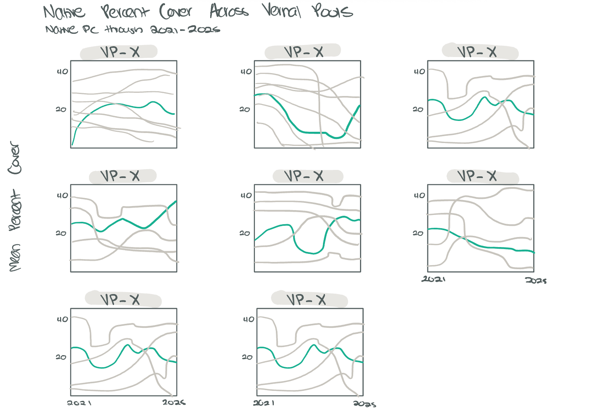

# Set Up 

## Packages

```{r}
#| label: packages
#| message: false
#| warning: false

# general use
library(tidyverse)

# file organization
library(here)

# data visualization
library(naniar)
library(patchwork)
library(gghighlight)
library(ggtext)
```

## Data 
```{r}
#| label: data
#| meassage: false 
#| warning: false 

veg <- read_csv(here("data", "veg copy-2.csv"))

metadata <- read_csv(here("data", "vp_veg_metadata copy-2.csv"))
```

# Problems

## 1. Explain your inspiration 

I chose to replicate the "Evolution of MTA Art Materials" by Steven Ponce. 
I decided to use this figure because the different panels for material preferences
translates well into different vernal pools. Furthermore, I want to demonstrate 
native percent cover over time across different vernal pools, so the line plot 
format seemed feasible and made sense for my project. The variables that I will
use from the veg / metadata data frame are year (x-axis), transect_name (facet wrap) by transect_name), and mean native percent cover (y-axis). The mean percent cover for the vernal pool of focus will be represented by the green line from the figure while the grey lines will represent the other vernal pool's mean percent cover for comparison. 

## 2. Plan your figure 



## 3. Code your figure 

```{r}
#| label: wrangling and cleaning data
#| message: false
#| warning: false

#adding class code
pools_explicit0 <- veg |> 
  # filter all occurrences where transect_name contains VP
  filter(str_detect(transect_name, "VP")) |> 
  # filter to include only include native cover
  filter(cover_category == "NATIVE COVER") |>
  # complete all possible combinations of year, pool, psoc, and distance
  complete(year, transect_name,cover_category, psoc, transect_distance,
           # fill values of percent cover with 0
           fill = list(percent_cover = 0)
           ) |>
  # group by year, pool, and psoc
  group_by(year, transect_name, cover_category) |>
  # calculate total percent cover across all quads
  summarize(sum_pc = sum(percent_cover, na.rm = TRUE)) |>
  # ungroup the data frame
  ungroup() |>
  # create a new column called year_pool from year and transect name
  unite("year_pool", year, transect_name, remove = TRUE) |> 
  # join with metadata data frame
  left_join(metadata, by = "year_pool") |> 
  # calculate mean percent cover from total percent cover/number of quadrats
  mutate(mean_pc = sum_pc/num_quad) 

```

```{r}
#| label: visualization parameters needed
#| message: false
#| warning: false

#plot parameters
#setting mean percent cover color
highlight_color <- "#4A9782"

#create plot title 
title_text <- "Native Percent Cover Across Vernal Pools"
#create plot subtitle 
subtitle_text <- "Native vegetation cover through 2021-2025 across vernal pools"

```

```{r}
#| label: coding figure
#| message: false
#| warning: false
#| fig-height: 8
#| fig-width: 10


# creating plot for pools_explicit0
p <- pools_explicit0 |>
  #base layer: ggplot
  #x axis is year, y axis is mean_pc
  #color by transect_name
  ggplot(aes(x = year,
             y = mean_pc,
             color = transect_name)) +
  #first layer: lines
  geom_line(linewidth = 1.3,
            alpha = 0.9) +
  #highlight pc line of interest (mean)
  #remove direct labels 
  #customize non highlighted lines / make lighter
  gghighlight(
    use_direct_label = FALSE,
    unhighlighted_params = list(
      linewidth = 0.3,
      alpha = 0.75,
      color = "gray60"
    )
  ) +
  #each pool has same green color 
scale_color_manual(
  values = c(
    "VP-01" = highlight_color,
    "VP-02" = highlight_color,
    "VP-03" = highlight_color,
    "VP-04" = highlight_color,
    "VP-05" = highlight_color,
    "VP-06" = highlight_color,
    "VP-07" = highlight_color,
    "VP-08" = highlight_color
  ),
  #remove legend
  guide = "none") +
  #customize x axis breaks and spacing
  scale_x_continuous(
    breaks = seq(2021, 2025, 1),
    expand = expansion(mult = c(0.01, 0.01))
  ) +
  #customize y axis spacing 
  scale_y_continuous(
    expand = expansion(mult = c(0, 0.1))
  ) +
  #adding title and subtitle 
  #remove x axis title for each individual panel 
  #adding y axis title 
  labs(
    title = title_text,
    subtitle = subtitle_text,
    x = NULL,
    y = "Mean native percent cover"
  ) +
  #seperate panels per vernal pool 
  facet_wrap(~ transect_name,
             scales = "free_y",
             ncol = 3) +
  #custom theme
  theme_bw() +
#customize plot appearance
theme(
  plot.title = element_text(
    size = rel(1.7),
    family = "Helvetica",
    face = "bold",
    color = "gray20",
    lineheight = 1.1,
    margin = margin(t = 5, b = 5)
  ),
  #customize subtitle apperance
  plot.subtitle = element_text(
    size = rel(0.95),
    family = "Helvetica",
    color = alpha("gray40", 0.9),
    lineheight = 1.2,
    margin = margin(t = 5, b = 20)
  ),
  #customize caption appearance
  plot.caption = element_markdown(
    size = rel(0.65),
    family = "Helvetica",
    color = "gray40",
    hjust = 0,
    margin = margin(t = 15, b = 5, l = 0),
    lineheight = 1.3
  ),
  # customize facet/panel text
  strip.text = element_text(
    size = 12,
    face = "bold",
    color = "gray20",
    family = "Helvetica",
    margin = margin(t = 5, b = 5)
  ),
  #customize facet background appearance
  strip.background = element_rect(
    fill = "gray95",
    color = "white",
    linewidth = 0.5
  ),
  #adjust spacing between panels
  panel.spacing = unit(1.5, "lines")
)

#display plot
p
```


## 4. Describe your process

My process of using someone elses code included having to go through which objects I would need to duplicate and adding relevant libraries needed, then I copied and pasted the relevant code, then I copied and pasted the plot code needed. After I had to go through each line to revise it to include my own data frames / to use my pools_explicit0 object. I ran into a lot of challeneges, the most difficult was figuring out which objects I needed and what libraries I needed to make those objects. When I needed to customize my plot apperance in my coding figure section, I really couldn't figure out how to create the fonts object because I had no idea what library it was coming from even when asking chat gpt, so I replaced it with custom colors that were very similar to the graph. My plot differs from class visualizations because it definitely is a bit more complex, for example in each panel there is a mean percent cover line but also lines of every other panel that is shaded grey which improves readability when comparing different mean percent covers among vernal pools. 


